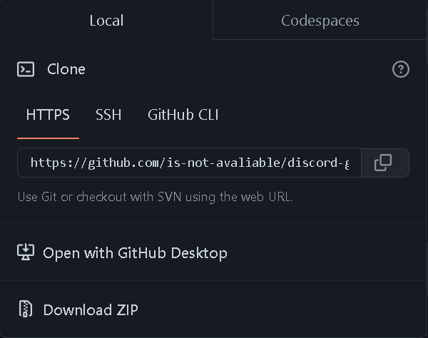
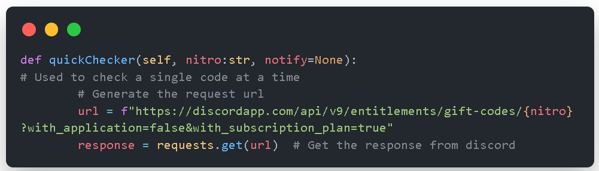
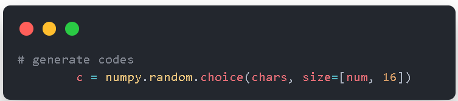

# discord-gift-generator (En español XD)
<hr>
A simple Discord gift generator &amp; CHECKER in Python

<hr>

**Instalación y ejecución**

* Descargar o clonar el repositorio



```bash
git clone https://github.com/is-not-avaliable/discord-gift-generator
```

* Mover al subdirectorio descargado o clonado

```bash
cd discord-gift-generator
```

* Ejecutar con python3

```
user@host: /discord-gift-generator$ python3 main.py
```

<hr>

# Algúnas preguntas.

## ¿Cómo chequean las url?



## ¿Cómo se generan las url's?



## No puedo usar el script porque no tengo los requerimientos. ¿Qué hago?

* Instalar los requermientos con el siguiente comando:

```bash
user@host: /discord-gift-generator$ pip3 install -r requirements.txt
```

